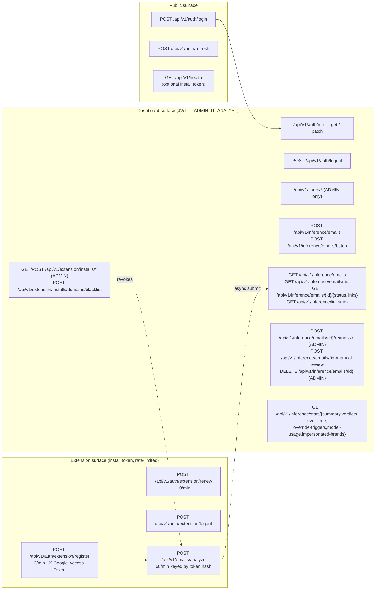

# SENTRY API

FastAPI backend for **SENTRY** — a phishing email detection and analysis system. This service ingests email content from two surfaces (a Gmail Chrome extension for live alerts and an admin dashboard for triage), classifies it with an LLM-driven multi-stage pipeline, and stores the verdict trail for analyst review.

The repo lives as a separate component because it owns three concerns that must not leak into the dashboard:
- **Privileged secrets** — Groq, Gemini, JWT, admin credentials.
- **Long-running work** — link unshortening, headless browser scraping, batched page analysis. These run as background `asyncio` tasks driven off a per-request handoff and would block any UI tier.
- **Two distinct auth surfaces** — JWT for dashboard users (`ADMIN`, `IT_ANALYST`) and SHA-256-hashed install tokens for Chrome extension installs. The two never share state and have separate revocation paths.

---

## What this service solves

- **Real-time phishing classification for Gmail.** The extension calls `POST /api/v1/emails/analyze`; only Stage 1 (the Groq classifier) runs on the request path, so the user gets a sub-second verdict. The same email is then handed off to the background pipeline for full link-and-page enrichment.
- **Analyst triage.** The dashboard reads paginated history (`GET /api/v1/inference/emails`), filterable by classification, confidence band, pipeline status, and override trigger; it can re-queue a verdict (`reanalyze`) or attach a manual override (`manual-review`).
- **Install governance.** Admins can blacklist a single install or every install on a domain, atomically revoking all of that install's tokens (`POST /api/v1/extension/installs/{id}/blacklist`, `POST /api/v1/extension/installs/domains/blacklist`).
- **Operational stats.** Pre-aggregated SQL feeds the dashboard charts (`/inference/stats/*`) — verdicts-over-time, override triggers, model usage, top impersonated brands.

---

## Architecture & design decisions

### Modular monolith with strict cross-module rules

Domain code lives at `src/modules/{auth,inference,extension}/` with a fixed shape:

```
domain/{models,repositories,services}/   # ORM, data access, business logic
internal/                                 # module-private helpers, seeders, background loops
presentation/{controllers,dtos}/          # FastAPI routers, request/response DTOs
presentation/dependencies.py              # service factories + role guards
```

A module **must not** import another module's `domain/` or `internal/` layer, with two exceptions:
1. Any module may import `get_current_user`, `require_role`, `Role`, `User` from `auth`.
2. A service may import a foreign repository directly for read-only data composition within the same session.

Cross-module **composition** lives in `src/core/`, not in either module. Two adapters demonstrate this:
- `src/core/inference_detector.py` — adapts the inference Stage-1 classifier to the extension's `Detector` protocol so `POST /emails/analyze` can call it without the extension knowing about inference internals.
- `src/core/extension_pipeline_submitter.py` — opens its own DB session and hands the analyzed email to `InferenceService.submit`, so the background pipeline runs independently of the extension request transaction.

These adapters are wired onto `app.state.detector` / `app.state.pipeline_submitter` in `lifespan` to avoid an import cycle at module-load time.

### Two auth surfaces, fully separate

- **Dashboard JWTs** (`auth` module): access + refresh pair, persisted in `tokens` so revocation is enforceable. `verify_token` decodes the JWT *and* checks the row is not revoked/expired. Login and refresh revoke all prior tokens for the user.
- **Extension install tokens** (`extension` module): a random opaque token, SHA-256 hashed before storage. `require_install` (`src/modules/extension/presentation/dependencies.py:169`) resolves the install, rejects revoked/expired tokens with `401 AUTH_FAILED`, rejects blacklisted installs with `403 NOT_WHITELISTED`, fires-and-forgets a `last_seen_at` bump, and exposes `request.state.install_token_hash` for the rate limiter and renewal flow. `require_install_for_logout` is a logout-only variant that is idempotent on already-revoked tokens.

Both surfaces use HS256, but the install-token path never touches `users`/`tokens` and the dashboard path never touches `extension_installs`/`extension_tokens`. Two background loops sweep expired rows on `TOKEN_CLEANUP_INTERVAL_SECONDS` and `EXTENSION_TOKEN_CLEANUP_INTERVAL_SECONDS`.

### Inference pipeline — request path stays cheap

The full pipeline has four stages, encoded in `PipelineStage` (`src/modules/inference/domain/models/enums.py`):

1. **Classification** — Groq LLM (`llama-3.1-8b-instant` by default) returns `Classification` (`phishing` / `suspicious` / `legitimate`), confidence, reasoning, and risk factors.
2. **Link resolution** — extracts URLs from the body, unshortens them through a registry of known shorteners, and runs three escalating scrape attempts: plain `httpx`, `httpx` with browser User-Agent, then Playwright headless. Concurrency is bounded by `INFERENCE_MAX_CONCURRENCY` (default 10).
3. **Page analysis** — batches resolved pages to Gemini (`gemini-1.5-flash`) for risk-level summarisation, capped at `SCRAPE_CONTENT_CHAR_CAP` chars per page.
4. **Aggregation** — combines Stage 1 + Stage 3, applies override rules (`OverrideTrigger`: `page_high_risk`, `page_medium_risk`, `all_low`, `all_failed`, `early_exit`), and writes the final classification.

**Early-exit rule.** If Stage 1 confidence ≥ `EARLY_EXIT_CONFIDENCE` (0.85), Stages 2/3 are skipped and the email is finalised with `OverrideTrigger.EARLY_EXIT`.

**Why background only.** `pipeline_runner.spawn` (`src/modules/inference/internal/pipeline_runner.py:24`) holds strong references to in-flight tasks in a module-level set so `asyncio.create_task`'s weak ref does not GC them mid-run. The lifespan calls `pipeline_runner.drain(timeout=30.0)` on shutdown to let in-flight work finish cleanly.

**Extension shortcut.** The extension's `analyze` endpoint runs Stage 1 inline (the `InferenceClassificationDetector` adapter), then submits the email to the same pipeline via the `InferencePipelineSubmitter` adapter. The user gets an immediate verdict; the heavy enrichment happens off the request path.

### Response envelope, errors, and DTOs

Every successful response returns `ApiResponse.ok(value=...)` or `PaginatedResponse.ok(value=..., page=..., total=..., page_size=...)`. `value` and `error` are mutually exclusive (validator-enforced). DTOs serialise with `model_dump(exclude_none=True, by_alias=True)` so the wire is camelCase (e.g. `createdAt`, `pipelineStatus`) — see `src/lib/api-core/types.ts` in the dashboard for the exact mirror.

Errors raise `AppException` subclasses (`NotFoundException`, `ConflictException`, `BadRequestException`, `AuthenticationException`, `AuthorizationException`, `ValidationException`, `InternalServerException`, `ServiceUnavailableException`). Global handlers in `src/shared/exceptions/error_handlers.py` convert them to the same envelope with `success: false` and an `ErrorDetail`.

### Config system (non-standard)

`src/configs/application.yaml` uses a pipe format: `"${ENV_VAR:default} | type"`, `"${ENV_VAR} | type | required"`, or `"literal | type"`. Types: `str`, `int`, `float`, `bool`, `list`. On import, `src/configs/__init__.py` resolves env vars, validates required fields (collecting every error before raising), and exposes each top-level section as a module attribute: `from src.configs import database; database.url`. It regenerates `src/configs/__init__.pyi` for IDE autocomplete; the boot path also regenerates it automatically.

Required env vars (startup aborts if unset): `DATABASE_URL`, `JWT_SECRET_KEY`, `ADMIN_PASSWORD`, `GROQ_API_KEY`, `GEMINI_API_KEY`.

### Why raw ASGI middleware

`RequestLoggingMiddleware` is raw ASGI on purpose — `BaseHTTPMiddleware` buffers response bodies and breaks SSE streaming. Any new middleware that may touch streaming responses must stay raw ASGI. `slowapi` is wired through the `@limiter.limit` decorator only; `SlowAPIMiddleware` is deliberately omitted for the same buffering reason. `RateLimitExceeded` is caught in `error_handlers.py` and returned with `code="RATE_LIMITED"`.

---

## Route map



---

## How it connects to the dashboard

The companion repo is **[sentry_frontend](https://github.com/kudzaiprichard/sentry_frontend)** (folder: `dashboard`).

| Direction | What flows | Initiator |
|---|---|---|
| dashboard → API | JWT login, then read-only stats + paginated email history; analyst writes (manual review, reanalyze, delete); admin install management (list, blacklist, revoke) | Dashboard, on user interaction |
| API → dashboard | `ApiResponse` / `PaginatedResponse` envelopes (camelCase); `401 AUTH_FAILED` triggers the dashboard's silent refresh flow against `/auth/refresh` | API, in response |

The dashboard's `axios` instance (`src/lib/api-core/api-clients.ts`) auto-unwraps `value`, queues requests during a 401 refresh, and clears cookies + redirects to `/login` if the refresh itself fails. Token lifetimes (30 min access, 7 day refresh) must stay in sync with `ACCESS_TOKEN_EXPIRE_MINUTES` / `REFRESH_TOKEN_EXPIRE_DAYS` here — the dashboard does not read `expires_at` from the response and instead sets cookie expiry to those constants.

The Chrome extension is a separate codebase (not in this repo); it talks to the same API on the `/api/v1/auth/extension/*` and `/api/v1/emails/analyze` routes.

---

## Setup

### Prerequisites

- Python 3.11+
- PostgreSQL 14+ (the schema uses `gen_random_uuid()` and `JSONB`)
- A Groq API key — <https://console.groq.com/keys>
- A Gemini API key — <https://aistudio.google.com/apikey>
- Playwright browsers — `playwright install chromium` (only needed if Stage 2 attempt-3 scraping is exercised)

### First run

```bash
# 1. Virtualenv
python -m venv venv
venv\Scripts\activate          # Windows
# source venv/bin/activate     # POSIX

# 2. Dependencies (pinned in requirements.txt; no pyproject.toml)
pip install -r requirements.txt

# 3. Env
cp .env.example .env
# fill DATABASE_URL, JWT_SECRET_KEY, ADMIN_PASSWORD, GROQ_API_KEY, GEMINI_API_KEY at minimum

# 4. Database
alembic upgrade head

# 5. Run (factory + reload)
python main.py
```

The app boots on `http://127.0.0.1:8000`. OpenAPI is served at `/docs`.

On first start, lifespan runs `seed_admin()` — if no `ADMIN` user exists, it creates one from `security.admin.*` env values. Login with `ADMIN_EMAIL` / `ADMIN_PASSWORD`.

### Alembic notes

`alembic/env.py` reads `DATABASE_URL` from `src.configs`, so the value in `alembic.ini` is ignored at runtime.

```bash
alembic revision --autogenerate -m "describe the change"
alembic upgrade head
alembic downgrade -1
```

### Tooling

No test suite, linter, or formatter is configured. Don't add one unless asked.

---

## Environment variables

Pulled from `.env.example` and `src/configs/application.yaml`. **Bold** marks variables that must be kept in sync with the dashboard.

### Application & DB
| Var | Default | Notes |
|---|---|---|
| `APP_NAME` | `MyApp` | Surfaces in `/health` |
| `APP_VERSION` | `0.1.0` | |
| `DEBUG` | `false` | Enables FastAPI debug mode |
| `ENVIRONMENT` | `development` | One of `development`, `staging`, `production` |
| `DATABASE_URL` *(required)* | — | `postgresql+asyncpg://user:pw@host:port/db` |
| `DB_POOL_SIZE` / `DB_MAX_OVERFLOW` / `DB_POOL_TIMEOUT` / `DB_ECHO` | 5 / 10 / 30 / false | |

### Auth
| Var | Default | Notes |
|---|---|---|
| `JWT_SECRET_KEY` *(required)* | — | `python -c "import secrets; print(secrets.token_hex(32))"` |
| `JWT_ALGORITHM` | `HS256` | |
| **`ACCESS_TOKEN_EXPIRE_MINUTES`** | `30` | Mirrored by `TOKEN_LIFETIMES.ACCESS_TOKEN_MINUTES` in the dashboard |
| **`REFRESH_TOKEN_EXPIRE_DAYS`** | `7` | Mirrored by `TOKEN_LIFETIMES.REFRESH_TOKEN_DAYS` in the dashboard |
| `ADMIN_EMAIL` / `ADMIN_USERNAME` / `ADMIN_FIRST_NAME` / `ADMIN_LAST_NAME` | `admin@sentry.local` / `admin` / `System` / `Admin` | Default-admin seed |
| `ADMIN_PASSWORD` *(required)* | — | Set before first boot |
| `TOKEN_CLEANUP_INTERVAL_SECONDS` | `3600` | Dashboard JWT sweep cadence |
| `EXTENSION_TOKEN_EXPIRE_DAYS` | `30` | |
| `EXTENSION_TOKEN_CLEANUP_INTERVAL_SECONDS` | `3600` | |

### CORS & rate limits
| Var | Default | Notes |
|---|---|---|
| **`CORS_ORIGINS`** | `http://localhost:3000,http://localhost:5173` | Must include the dashboard origin. Cannot be `*` while `CORS_ALLOW_CREDENTIALS=true` |
| `CORS_ALLOW_CREDENTIALS` / `CORS_ALLOW_METHODS` / `CORS_ALLOW_HEADERS` | `true` / `*` / `*` | |
| `CORS_ORIGIN_REGEX` | `^chrome-extension://[A-Za-z0-9_-]+$` | Lets Chrome-extension origins through |
| `EXTENSION_CORS_ORIGINS` | `https://mail.google.com` | Extra origins for extension routes |
| `RATE_LIMIT_EXTENSION_REGISTER` / `_RENEW` / `_PREDICT` | `3/minute` / `10/minute` / `60/minute` | slowapi expressions |

### Allow / block lists
| Var | Notes |
|---|---|
| `EXTENSION_ALLOWLIST_DOMAINS` / `EXTENSION_ALLOWLIST_EMAILS` | Empty = allow all. Otherwise restrict register-time |
| `EXTENSION_BLOCKLIST_DOMAINS` / `EXTENSION_BLOCKLIST_EMAILS` | Hard reject at register and on every protected call |
| `EXTENSION_GOOGLE_OAUTH_CLIENT_ID` | Optional — enables `tokeninfo` audience check |

### Inference
| Var | Default | Notes |
|---|---|---|
| `GROQ_API_KEY` *(required)* | — | Stage 1 |
| `GROQ_MODEL` / `GROQ_TIMEOUT_SECONDS` | `llama-3.1-8b-instant` / `30` | |
| `GEMINI_API_KEY` *(required)* | — | Stage 3 |
| `GEMINI_MODEL` / `GEMINI_TIMEOUT_SECONDS` | `gemini-1.5-flash` / `60` | |
| `SCRAPE_ATTEMPT_1_TIMEOUT` / `_2` / `_3` | `5` / `8` / `15` | Plain httpx, browser-UA httpx, Playwright |
| `SCRAPE_USER_AGENT` | Chrome 120 UA | |
| `SCRAPE_CONTENT_CHAR_CAP` | `1000` | Max chars per page sent to Gemini |
| `EARLY_EXIT_CONFIDENCE` | `0.85` | Skip Stages 2/3 above this |
| `INFERENCE_BATCH_MAX` | `50` | Cap per `POST /emails/batch` |
| `INFERENCE_MAX_CONCURRENCY` | `10` | Per-email link-task semaphore |
| `INFERENCE_ALERT_THRESHOLD` | `0.90` | `should_alert=true` cutoff for `/emails/analyze` |
| `INFERENCE_EMAILS_MAX_BODY_BYTES` | `102400` | `400 BAD_REQUEST` above this |

### Logging
| Var | Default |
|---|---|
| `LOG_LEVEL` | `INFO` |
| `LOG_FILE_PATH` | `logs/app.log` |

---

## Related repositories

| Repo | Role | Description |
|---|---|---|
| **[sentry-api](https://github.com/kudzaiprichard/sentry-api)** | Backend API (this repo) | FastAPI + PostgreSQL service. Owns auth, the inference pipeline (Groq + Gemini + Playwright), and extension install governance. |
| **[sentry_frontend](https://github.com/kudzaiprichard/sentry_frontend)** | Admin dashboard | Next.js 16 + React 19 panel for analyst triage, stats, user management, and install blacklisting. Talks to this API via JWT. |
